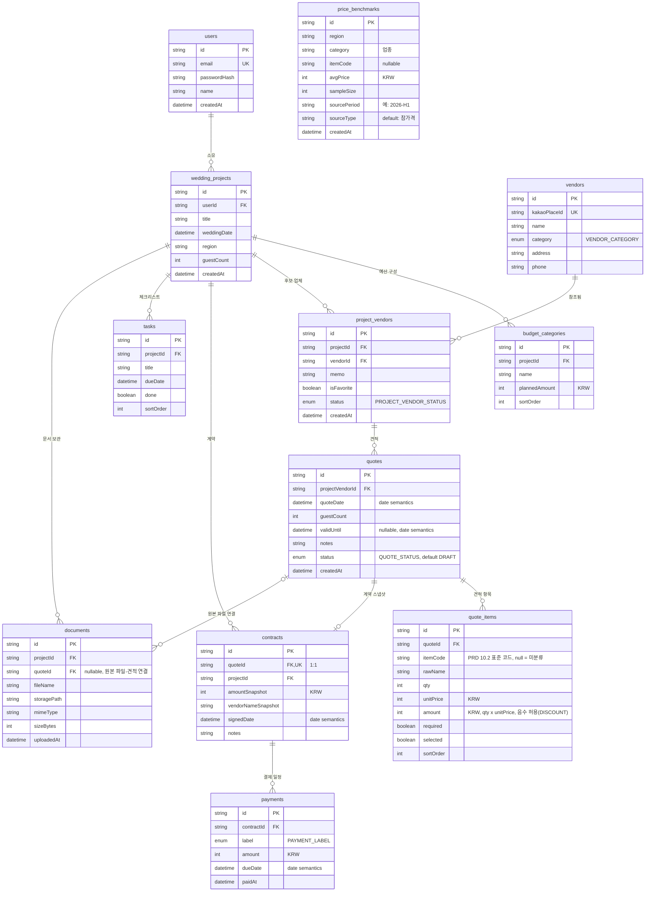

# ERD — wedding-plan MVP

Prisma 스키마(`prisma/schema.prisma`) 전체 12개 테이블의 관계 다이어그램이다.
금액 컬럼은 전부 `Int`(원, KRW)이며, DISCOUNT 항목처럼 음수가 허용되는 부호 금액도 `Int`로 표현한다(Float/Decimal 미사용).

## 삭제 동작 (ON DELETE)

| 관계 | onDelete | 근거 |
| --- | --- | --- |
| users → wedding_projects | Cascade | 프로젝트는 사용자 소속 |
| wedding_projects → budget_categories | Cascade | 예산은 프로젝트 소속 |
| wedding_projects → project_vendors | Cascade | 후보 목록은 프로젝트 소속 |
| vendors → project_vendors | Restrict | 업체 마스터는 참조 중 삭제 불가 (task-4 선례) |
| project_vendors → quotes | Cascade | 견적은 후보 관계 소속 |
| quotes → quote_items | Cascade | 항목은 견적 소속 |
| quotes → contracts | **Restrict** | 계약 스냅샷이 재무 기준점. 견적 삭제가 계약을 조용히 지우지 못하게 함 — 계약을 먼저 삭제해야 함 |
| wedding_projects → contracts | Cascade | 프로젝트 삭제 시 계약 함께 삭제 |
| contracts → payments | Cascade | 결제 일정은 계약 소속 |
| wedding_projects → tasks | Cascade | 체크리스트는 프로젝트 소속 |
| wedding_projects → documents | Cascade | 문서 기록은 프로젝트 소속 |
| quotes → documents | **SetNull** | 업로드 파일 기록은 견적 연결이 끊겨도 남고, 링크만 해제됨 (nullable FK) |

## 설계 노트

- **날짜 컬럼**: `quoteDate`, `validUntil`, `signedDate`, `dueDate` 등 "날짜" 의미 컬럼도 Prisma `DateTime`으로 둔다. Prisma 7 + mysql 커넥터에서 `@db.Date`(네이티브 DATE) 사용 가능성을 확인하기보다, 날짜 전용 의미는 애플리케이션 계층에서 강제하기로 한다(태스크 명세의 기본 선택).
- **금액**: 모든 금액은 `Int`(원). `quote_items.amount`는 `qty × unitPrice`이며 DISCOUNT 항목은 음수로 기록한다(부호 허용).
- **문서-AI 분석**: PRD 8장의 `document_extractions`는 MVP 범위 백로그(`docs/ROADMAP-non-mvp.md`)로 분리되어 이 스키마에 없다.
- **가격 벤치마크**: `@@unique([region, category, itemCode, sourcePeriod])`로 지역·업종·항목·기간 단위 중복을 막는다. `itemCode`가 NULL이면 MySQL 특성상 유니크 중복 판정에서 제외된다.
